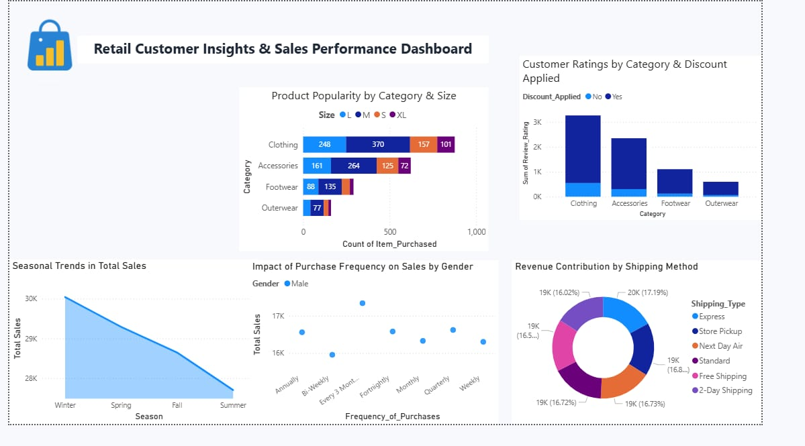

# Retail Customer Insights & Sales Performance Dashboard

## Overview
An interactive Power BI dashboard analyzing retail sales performance across product categories, sizes, customer ratings, and shipping methods to support merchandising and logistics decisions.

## Key Insights
- Clothing was the top-performing category across all sizes, led by Medium and Small
- Discount application correlated with review ratings across all four product categories
- Total sales declined steadily from Winter through Summer, indicating strong seasonal demand
- Revenue was fairly evenly distributed across six shipping methods (16–17% each), with Store Pickup slightly ahead

## Tools Used
- Power BI Desktop
- DAX (measures for sales aggregation, category breakdowns)
- Power Query (data cleaning/transformation)

## Dataset
Raw data: [retail-sales-data.xlsx](sheet1.xlsx)
