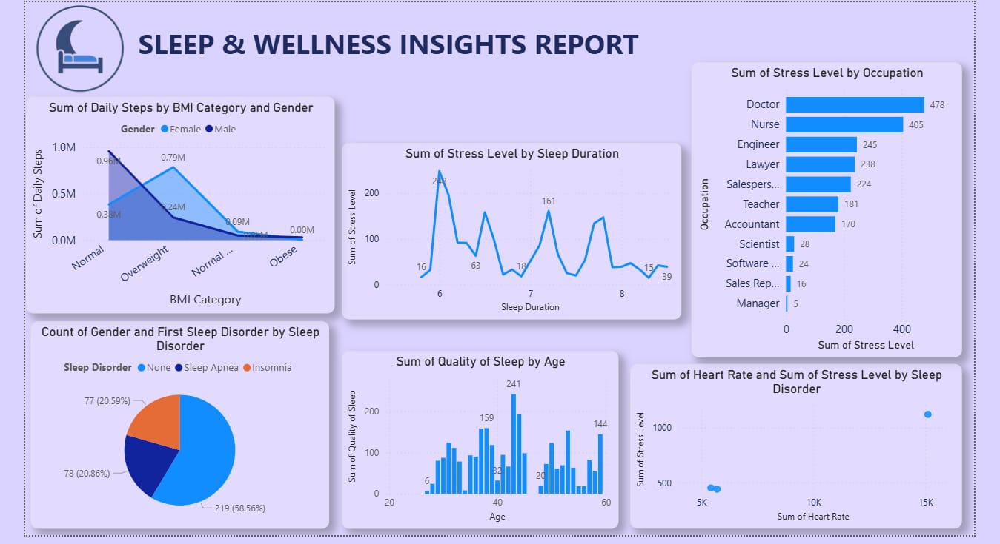

# Sleep & Wellness Insights Report

## Overview
An analysis of a health and lifestyle dataset exploring relationships between physical activity, BMI, stress, occupation, and sleep quality.

## Key Insights
- Individuals with Normal BMI logged the highest daily step counts; step counts dropped sharply for Overweight and Obese categories
- Stress levels varied non-linearly by sleep duration, with the highest spike at 6 hours of sleep
- Doctors and nurses reported the highest occupational stress levels (478 and 405 respectively), far above other professions
- 58.6% of respondents reported no sleep disorder; the remainder was split between insomnia (20.6%) and sleep apnea (20.9%)
- Quality of sleep peaked around age 40, tapering at both younger and older age groups

## Tools Used
- Power BI Desktop
- DAX (aggregations by BMI category, occupation, sleep disorder)

## Dataset
[Sleep Health and Lifestyle Dataset — Kaggle](https://www.kaggle.com/) 
